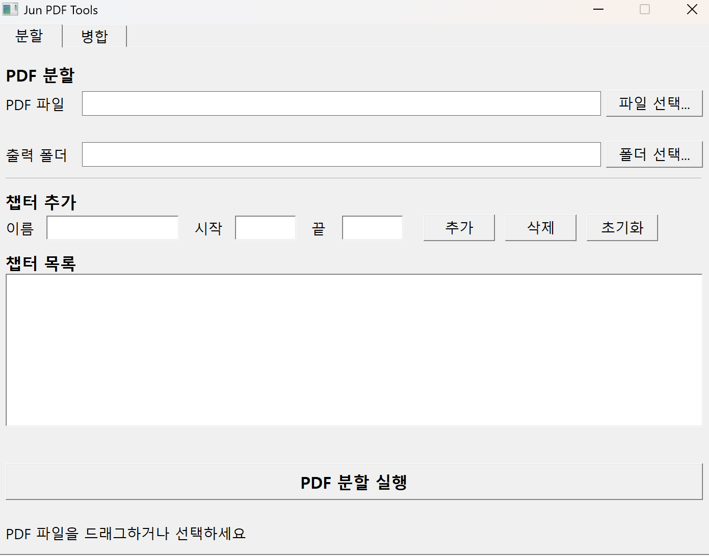
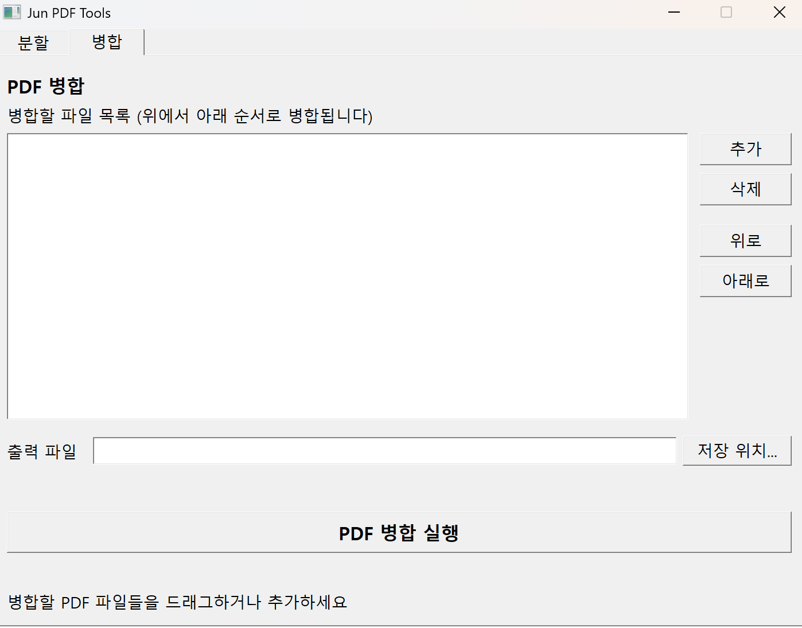

# Jun PDF Tools

PDF 파일을 간편하게 분할하고 병합할 수 있는 Windows 프로그램입니다.

## 주요 기능

- **PDF 분할**: 하나의 PDF를 여러 챕터로 나누기
- **PDF 병합**: 여러 PDF 파일을 하나로 합치기
- **드래그 앤 드롭**: 파일을 끌어다 놓기만 하면 OK
- **설치 불필요**: 다운로드 후 바로 실행

## 스크린샷

### PDF 분할

### PDF 병합

## 다운로드

[Releases](https://github.com/007yoin/jun-pdf-splitter/releases) 페이지에서 최신 버전을 다운로드하세요.

## 사용법

### PDF 분할

1. "분할" 탭 선택
2. PDF 파일 선택 (또는 드래그 앤 드롭)
3. 출력 폴더 선택
4. 챕터 추가 (이름, 시작 페이지, 끝 페이지)
5. "PDF 분할 실행" 클릭

### PDF 병합

1. "병합" 탭 선택
2. PDF 파일들 추가 (또는 드래그 앤 드롭)
3. 위로/아래로 버튼으로 순서 조정
4. 출력 파일 경로 지정
5. "PDF 병합 실행" 클릭

## 시스템 요구사항

- Windows 10 이상
- 64비트 운영체제

## 라이선스

MIT License
